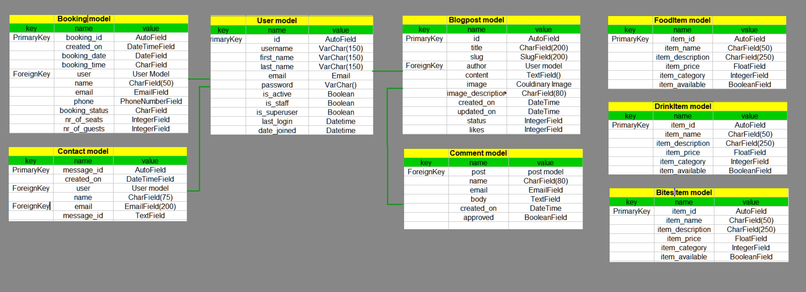
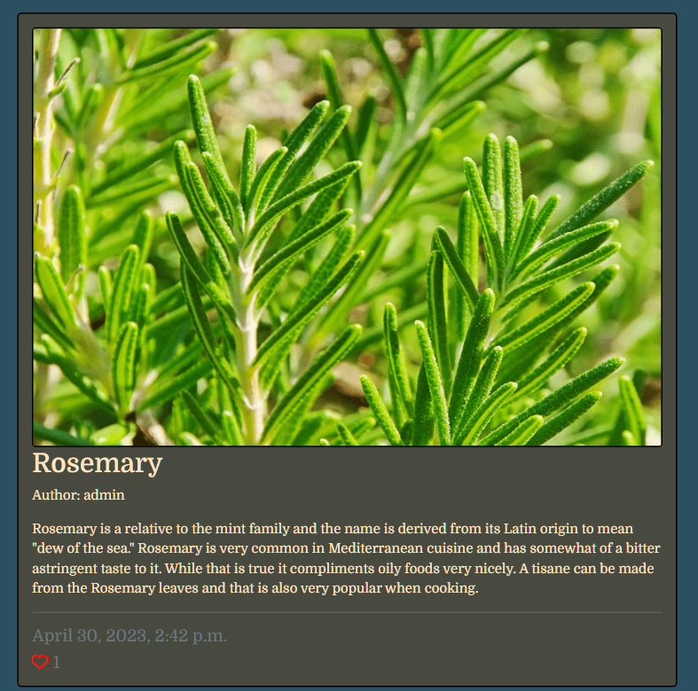
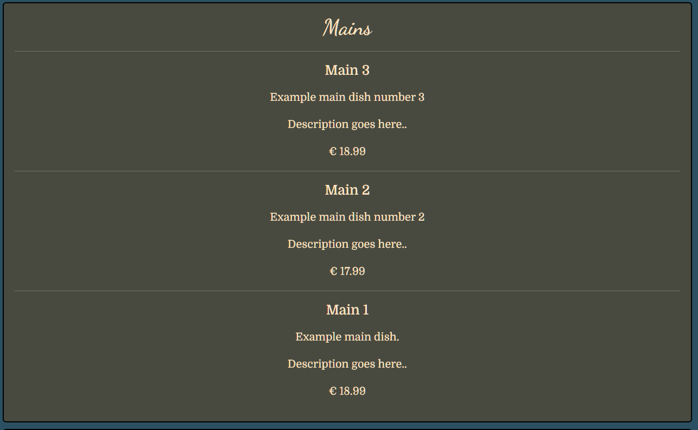
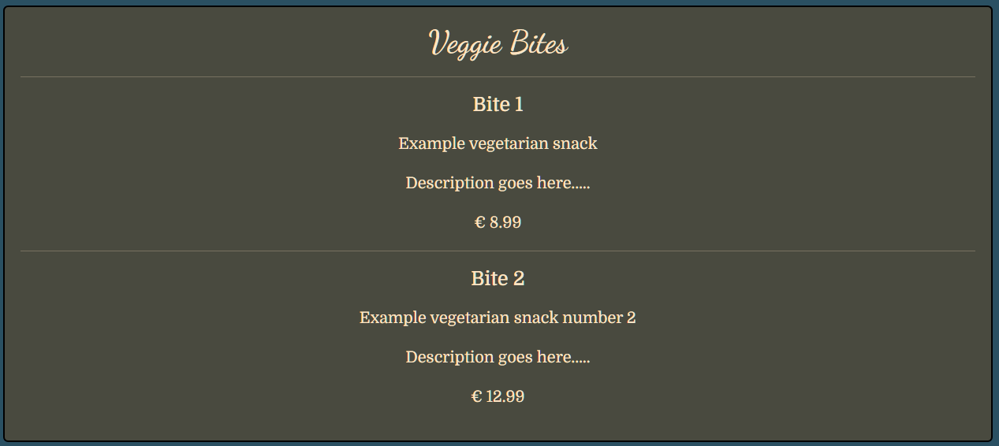
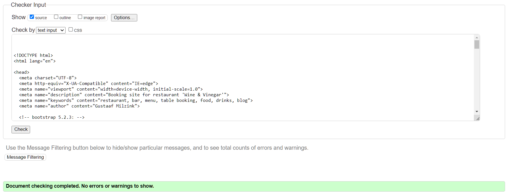
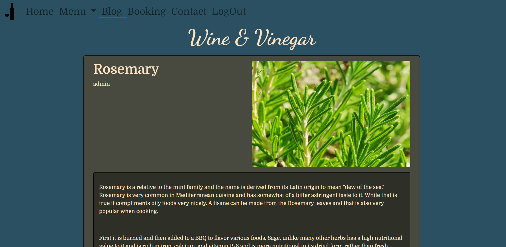
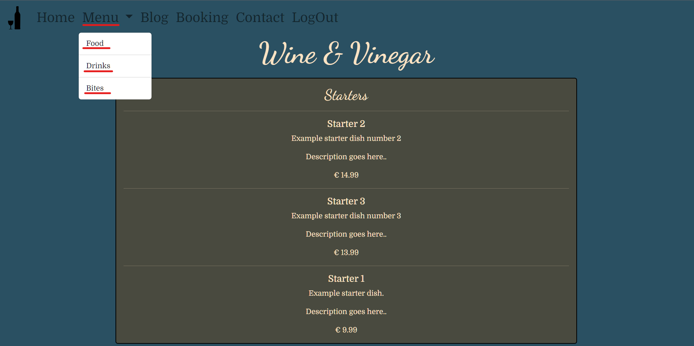
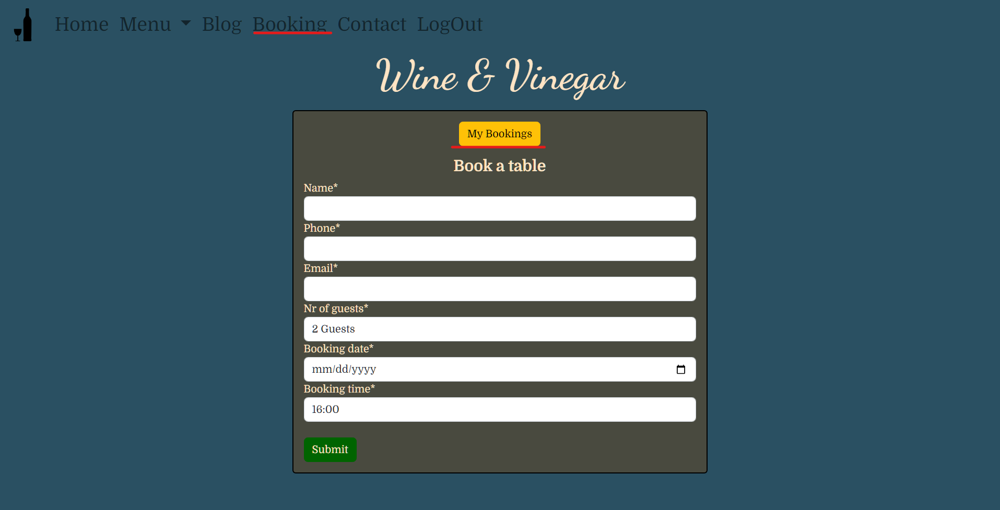
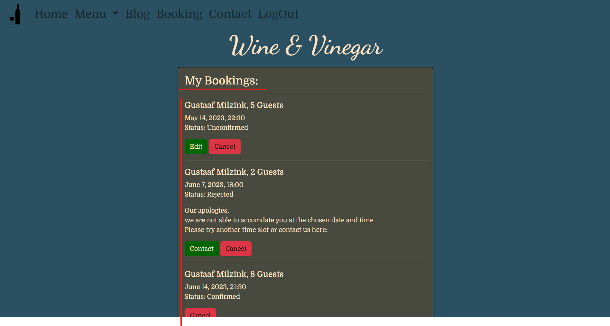

# Wine & Vinegar | Restaurant

**Developer: Gustaaf Milzink**

[Visit live website](https://ci-pp4-rbs.herokuapp.com/)

## Table of Contents
- [About](#about)
- [User Goals](#user-goals)
- [Site Owner Goals](#site-owner-goals)
- [User Experience](#user-experience)
- [User Stories](#user-stories)
- [Design](#design)
    - [Colours](#colours)
    - [Fonts](#fonts)
    - [Structure](#structure)
      - [Website pages](#website-pages)
      - [Database](#database)
    - [Wireframes](#wireframes)
- [Technologies Used](#technologies-used)
- [Features](#features)
- [Validation](#validation)
- [Testing](#testing)
    - [User Story testing](#user-story-testing)
    - [Tests on various devices](#tests-on-various-devices)
    - [Browser compatibility](#browser-compatibility)

### About

Wine & Vinegar is a fictional restaurant. The website provides users the abillity to view the menu, read a blog, view the menu and book a table.

### User Goals

- The abillity to book a table.
- The abillity to view edit and cancel bookings.
- The abillity to view the menu, contact info and blog.

### Site Owner Goals

- Provide a website with an intuitive responnsive design.
- Facillitate communication with customers through a blog and contact form.
- Allow users to book a table.
- Attract additional business with an aestheticly pleasing website.

## User Experience

### Target Audience

- People looking for a place to have a meal.
- People who wish to book a table for a meal.
- Potential customers who want to get a sense of the atmosphere in the restautrant.
- Returning customers who want to know the current menu
- New and Returning customers who want to know more about what's happening in the restaurant.

### User Requirements and Expectations

- A welcoming design
- Accessibility
- Full responsiveness
- Contact information

## User Stories

### Site Owner 

1. As site owner I want the site to be fully responsive so that I can provide a good user experience.
2. As site owner I want to provide a contact page so that users can find/contact the restaurant easily.
3. As site owner I want users to be able to view the menu so that they can easily ddecide wether or not to book with us.
4. As site owner I want users to be able to book a table online.
5. as site owner I want to be able to maintain a blog so that users can be informed about the goings on in the restaureant.

### Admin

6. As site admin I want to be able to login so that I can acces the backend of the site.
7. As site admin I want to be able to view/make changes to the menus so that I can keep it up to date.
8. As site admin I want to be able confirm or reject a booking so that I can avoid double bookings.
9. As site admin I want to be able to manually enter a booking so that I can book a table in response to a user's phonecall or email.
10. As site admin I want to be able to post articles to the blog so that I can maintain customer communication.
11. As site admin I want to be able to approve blog-comments so that I can make sure nothing innaprorpiate is displayed.
12. As site admin I want to be able to filter bookings by date so that I can see wich bookings we have for a partivular day.

### Users

13. As site user I want to be able to easily navigate the site to find the information I am looking for.
14. As site user I want to be able to view the menu.
15. As site user I want to be able to easily contact the restaurant.
16. As site user I want to be able to be able to see the restaurants opening times and location.
17. As site user I want to be able to get a sense of the atmosphere in the restaurant.
18. As site user I want to be able to login so that I can book a table.
19. As site user I want to be able to view previous bookings. 
20. As site user I want to be able to edit an unconfirmed booking.
21. As site user I want to be able to cancel a booking.
22. As site user I want to be able to comment on/like a blogpost so that I can communicate what I think of the content.
23. As site user I want to be able to get confirmation of any action I take so that I know it was successfull.

### Epics

##### Back to [top](#table-of-contents)

## Design

### Colours

For the colour scheme I have selected a set of light colours to represent the open and informal atmosphere of the restaurant.
This also helps distuingish the site from many other sites that often use a darker theme these days.

Original colour palette:

### Fonts

 Two Google fonts where used across the site:
 1. "Dancing Script" with cursive as fallback.
 2. "Domine" with sans-serif as fallback.

 The fonts where chosen to complement each other and generate a sense of style/class across the site.

 ### Structure

 #### Website pages

 The site was designed to utilize a familiar navigational structure consisting of a navigation bar along the top of the screen
 wich collapses into a "hamburger menu" on smaller screen sizes. These are present across all pages.

 - The site contains the following pages:
    - Homepage with image carousel and image0-links to the menu, booking and blog pages for easy navigation.
    - Food menu listing all currently available starters, mains and desserts.
    - Drinks menu listing all currently available drinks.
    - Bites menu listing all currently available snacks/bites.
    - Blog page listing all published blogs on a single page.
    - Blog detail shows a single blogpost for reading.
    - Booking page allowing users to make a booking and provides a link to a list of all the users previous bookings.
    - Booking list allows users to view bookings.
    - Edit booking allows users to edit any unconfirmed bookings.
    - Cancel booking allows user to cancel a booking and removes it from the database.
    - Contact allows a user to easily send a message to the restauant staff.
    - Sign Up allows the user to create an acount so they can use all the sites features.
    - Login allows users to log in to their acount so they can utilize the sites features.
    - 404 error page to display in the event a 404 error is raised, provides quick link back to homepage.

#### Database

Built using Python and the Django framework, using ElephantSQL for the deployed version.

Database diagram

##### User Model
The User Model contains the following:
- user_id
- password
- last_login
- is_superuser
- username
- first_name
- last_name
- email
- is_staff
- is_active
- date_joined

##### FoodItem Model
The FoodItem Model contains the following:
- item_id
- item_name
- item_description
- item_price
- item_category
- item_available

##### DrinkItem Model
The DrinkItem Model contains the following:
- item_id
- item_name
- item_description
- item_price
- item_category
- item_available

##### BitesItem Model
TheBitesItem Model contains the following:
- item_id
- item_name
- item_description
- item_price
- item_category
- item_available

##### Blogpost Model
The Blogpost Model contains the following:
- post_id
- title
- slug
- author
- content
- image
- created_on
- updated-on
- status
- likes

##### Comment Model
The Comment Model contains the following:
- post
- name
- email
- body
- created_on
- approved

##### Booking Model
The Booking Model contains the following:
- booking_id
- created_on
- booking_date
- booking_time
- user
- name
- email
- phone
- booking_status
- nr_of_seats
- nr_of_guests

##### Contact Model
The Contact Model contains the following:
- message_id
- created_on
- user
- name
- email

### Wireframes
The wireframes were created using Balsamiq

Home

Menu

Blog

Blog Detail

Booking

Contact

SignUp

LogIn

 

## Technologies Used

### Languages & Frameworks

- HTML
- CSS
- Javascript
- Python
- Django

### Libraries & Tools

- [Am I Responsive](http://ami.responsivedesign.is/)
- [Balsamiq](https://balsamiq.com/)
- [Bootstrap v5.2](https://getbootstrap.com/)
- [Cloudinary](https://cloudinary.com/)
- [Favicon.io](https://favicon.io)
- [Chrome dev tools](https://developers.google.com/web/tools/chrome-devtools/)
- [Font Awesome](https://fontawesome.com/)
- [GitPod](https://gitpod.io/)
- [GitHub](https://github.com/)
- [Google Fonts](https://fonts.google.com/)
- [Heroku Platform](https://id.heroku.com/login)
- [jQuery](https://jquery.com)
- [ElephantSQL](https://www.elephantsql.com/)
- [Summernote](https://summernote.org/)
- [Whitenoise](https://pypi.org/project/whitenoise/)

- Validation:
  - [WC3 Validator](https://validator.w3.org/)
  - [Jigsaw W3 Validator](https://jigsaw.w3.org/css-validator/)
  - [JShint](https://jshint.com/)
  - [Pycodestyle(PEP8)](https://pypi.org/project/pycodestyle/)
  - [Lighthouse](https://developers.google.com/web/tools/lighthouse/)
  - [Wave Validator](https://wave.webaim.org/)

##### Back to [top](#table-of-contents)

## Features

### Logo & Navigation
- Fully Responsive
- On small screens switches to hamburger menu
- Indicates login/logout in status
- displayed across all pages

images

 

### Home page
- Includes image carousel, welcome text and image links to: Food menu, Table Booking and Blog.

images

 

### Sign up
- Allow users to register an acoount
- Username and password are required
- email is optional

images

 

### Log In
- User can login to make use of the sites features.(make a booking, edit/cancel a booking, send message, comment/like blogposts)

images

 

### Log Out
- User can logout to prevent others from utilizing their account

images

 

### Blog
- Displays all posts made by staff members.

images

 

### Blog Detail
- Displays specific blogpost as selected by user.
- Displays a featured image uploaded by the poster
- If no image is uploaded a default image is then used
- Users that have signed up/logged in can comment on/like the post.

images

 

### Booking
- Allows registered users to book a table by way of the booking form.
- Form will only submit if all fields are filled out and are valid.
- A message will alert users to incorrectly filled out/empty fields.
- Provides a link to the users booking overview.
- Booking status is displayed.
- If a booking is rejected a message is displayed to the user and link to the contact page is provided.
- Unconfirmed bookings can be edited/cannceled.
- Confirmed bookings can not be edited only canceled.

images

 

### Contact Us
- Registered users can send a message to restaurant staff
- Adress and contact information is displayed.
- Google map is provided

images

 

### Food Menu
- Displays all currently available food menu items.
- Menu items can be added by staff via the site's backend.
- Menu item availability can be set via the sites backend.
- Menu items are seperated into "Starters", "Mains" and "Desserts".

images

 

### Drinks Menu
- Displays all currently available drink menu items.
- Menu items can be added by staff via the site's backend.
- Menu item availability can be set via the sites backend.
- Menu items are seperated into "Beers", "Wines" and "Non Alchoholic".

images

 

### Bites Menu
- Displays all currently available bites menu items.
- Menu items can be added by staff via the site's backend.
- Menu item availability can be set via the sites backend.
- Menu items are seperated into "Beers", "Wines" and "Non Alchoholic".

images

 

## Validation

The pages files were validated using W3C Markup Validation Service. All pages passed with no errors.

Home

Food Menu

Drinks Menu

Bites Menu

Blog

Blog Detail

Booking

My Bookings

Edit Booking

Cancel Booking

Contact

Message Sent

Sign Up

Log In

Log Out

### CSS Validation
CSS was validated using the W3C Jigsaw CSS Validation Service. No errors reported.

style.css

### PEP8 Validation
PEP8 Validation Service was used to check the code for PEP8 requirements via Pycodestyle. No errors were reported.

Home

admin.py

urls.py

views.py

Menu

admin.py

urls.py

views.py

models.py

Blog

admin.py

urls.py

views.py

models.py

forms.py

Booking

admin.py

urls.py

views.py

models.py

forms.py

Contact

admin.py

urls.py

views.py

models.py

forms.py

Project

manage.py

settings.py

urls.py

### WAVE TESTING

### LIGHTHOUSE TESTING

##### Back to [top](#table-of-contents)

## Testing

### user story testing

1. As site owner I want the site to be fully responsive so that I can provide a good user experience.

| **Feature** | **Action** | **Expected Result** | **Actual Result** |
|-------------|------------|---------------------|-------------------|
|All pages|view site on various screens|site adapts|Works as expected|

images

2. As site owner I want to provide a contact page so that users can find/contact the restaurant easily.

| **Feature** | **Action** | **Expected Result** | **Actual Result** |
|-------------|------------|---------------------|-------------------|
|Contact Page|click contact link|find contact page|Works as expected|

images

3. As site owner I want users to be able to view the menu so that they can easily decide wether or not to book with us.

| **Feature** | **Action** | **Expected Result** | **Actual Result** |
|-------------|------------|---------------------|-------------------|
|Menu Page|click menu link|find menu page|Works as expected|

images

4. As site owner I want users to be able to book a table online.

| **Feature** | **Action** | **Expected Result** | **Actual Result** |
|-------------|------------|---------------------|-------------------|
|Booking Page|click booking link|find booking page|Works as expected|

images

4. As site owner I want users to be able to book a table online.

| **Feature** | **Action** | **Expected Result** | **Actual Result** |
|-------------|------------|---------------------|-------------------|
|Booking Page|click booking link|find booking page|Works as expected|

images

5. as site owner I want to be able to maintain a blog so that users can be informed about the goings on in the restaurant.

| **Feature** | **Action** | **Expected Result** | **Actual Result** |
|-------------|------------|---------------------|-------------------|
|Blog Page|click blog link|find booking page|Works as expected|
|Admin Panel|navigate to admin panel|find blog entry section|Works as expected|

images

6. As site admin I want to be able to login so that I can acces the backend of the site.

| **Feature** | **Action** | **Expected Result** | **Actual Result** |
|-------------|------------|---------------------|-------------------|
|Admin Panel|navigate to admin panel|find login page|Works as expected|

images

7. As site admin I want to be able to view/make changes to the menus so that I can keep it up to date.

| **Feature** | **Action** | **Expected Result** | **Actual Result** |
|-------------|------------|---------------------|-------------------|
|Admin Panel|navigate to admin panel|find menu sections|Works as expected|

images

8. As site admin I want to be able confirm or reject a booking so that I can avoid double bookings.

| **Feature** | **Action** | **Expected Result** | **Actual Result** |
|-------------|------------|---------------------|-------------------|
|Admin Panel|navigate to admin panel|find bookings section|Works as expected|

images

9. As site admin I want to be able to manually enter a booking so that I can book a table in response to a user's phonecall or email.

| **Feature** | **Action** | **Expected Result** | **Actual Result** |
|-------------|------------|---------------------|-------------------|
|Admin Panel|navigate to admin panel|find bookings section|Works as expected|

images

10. As site admin I want to be able to post articles to the blog so that I can maintain customer communication.

| **Feature** | **Action** | **Expected Result** | **Actual Result** |
|-------------|------------|---------------------|-------------------|
|Admin Panel|navigate to admin panel|find blog section|Works as expected|

images

11. As site admin I want to be able to approve blog-comments so that I can make sure nothing innaprorpiate is displayed.

| **Feature** | **Action** | **Expected Result** | **Actual Result** |
|-------------|------------|---------------------|-------------------|
|Admin Panel|navigate to admin panel|find comments section|Works as expected|

images

12. As site admin I want to be able to filter bookings by date so that I can see wich bookings we have for a particular day.

| **Feature** | **Action** | **Expected Result** | **Actual Result** |
|-------------|------------|---------------------|-------------------|
|Admin Panel|navigate to admin panel|find bookings section|Works as expected|

images

13. As site user I want to be able to easily navigate the site to find the information I am looking for.

| **Feature** | **Action** | **Expected Result** | **Actual Result** |
|-------------|------------|---------------------|-------------------|
|Navigation Bar|Click apropriate link|find expected page|Works as expected|

images

14. As site user I want to be able to view the menu.

| **Feature** | **Action** | **Expected Result** | **Actual Result** |
|-------------|------------|---------------------|-------------------|
|Navigation Bar|Click apropriate link|find menu page|Works as expected|

images

15. As site user I want to be able to easily contact the restaurant.
| **Feature** | **Action** | **Expected Result** | **Actual Result** |
|-------------|------------|---------------------|-------------------|
|Navigation Bar|Click apropriate link|find contact page|Works as expected|

images

16. As site user I want to be able to be able to see the restaurants opening times and location.

| **Feature** | **Action** | **Expected Result** | **Actual Result** |
|-------------|------------|---------------------|-------------------|
|Contact Page|Scroll down|find adress & info|Works as expected|

images

17. As site user I want to be able to get a sense of the atmosphere in the restaurant.

| **Feature** | **Action** | **Expected Result** | **Actual Result** |
|-------------|------------|---------------------|-------------------|
|Home Page|Open Site|see carousel|Works as expected|

images

18. As site user I want to be able to login so that I can book a table.

| **Feature** | **Action** | **Expected Result** | **Actual Result** |
|-------------|------------|---------------------|-------------------|
|Login Page|Navigate to login|Find login page|Works as expected|
|Booking Page|Navigate to booking|Find booking page|Works as expected|

images

19. As site user I want to be able to view previous bookings. 

| **Feature** | **Action** | **Expected Result** | **Actual Result** |
|-------------|------------|---------------------|-------------------|
|Booking Page|Navigate to booking|Find my bookings link|Works as expected|
|My Bookings Page|click my bookings link|Find my bookings list|Works as expected|

images

20. As site user I want to be able to edit an unconfirmed booking.

| **Feature** | **Action** | **Expected Result** | **Actual Result** |
|-------------|------------|---------------------|-------------------|
|My Bookings Page|click edit button|Find edit form|Works as expected|

images

21. As site user I want to be able to cancel a booking.

| **Feature** | **Action** | **Expected Result** | **Actual Result** |
|-------------|------------|---------------------|-------------------|
|My Bookings Page|click cancel button|Find cancel page|Works as expected|

images

22. As site user I want to be able to comment on/like a blogpost so that I can communicate what I think of the content.

| **Feature** | **Action** | **Expected Result** | **Actual Result** |
|-------------|------------|---------------------|-------------------|
|Blog Detail Page|click heart|post is liked|Works as expected|
|Blog Detail Page|post comment|comment is submitted for approval|Works as expected|

images

23. As site user I want to be able to get confirmation of any action I take so that I know it was successfull.

| **Feature** | **Action** | **Expected Result** | **Actual Result** |
|-------------|------------|---------------------|-------------------|
|Popup message|take perform user action|message is displayed|Works as expected|

images

